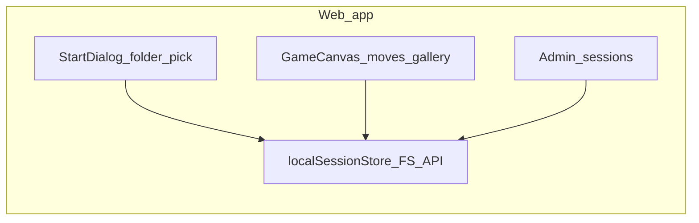
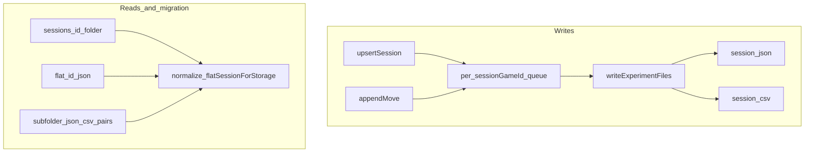

# Creative Foraging (MediaPipe): Web + PsychoPy

**GitHub repository:** [renanbazinin/creative-foraging-game-local](https://github.com/renanbazinin/creative-foraging-game-local) — **this `README.md` is the repository homepage** (full documentation).

**Live demo (GitHub Pages):** [creative-foraging-game-local](https://renanbazinin.github.io/creative-foraging-game-local/)


Browser-based **Creative Foraging** task (drag-and-connect blocks, gallery saves, timed experiment) with optional **MediaPipe Hands** bracelet color detection and **local-first** session files (no app server). A **PsychoPy** implementation and a **Python** wrist-band prototype live alongside the web app in this repository.

**Monorepo checkout:** If your local folder is nested (for example `…/openSourceCreativeForaginGame/Creative-Foraging-Detection-Media-Pipe/`), treat this directory as the same root [shown on GitHub](https://github.com/renanbazinin/creative-foraging-game-local); paths below are relative to this project root.

---

## Research goals

- **Primary task:** Participants arrange ten blocks on a grid to build figures they find interesting; they can save snapshots to a **gallery**. The design follows creative/foraging-style exploration paradigms used in cognitive science.
- **Prior work:** The original Creative Foraging Game is due to **Kristian Tylén (AU 2018)**. This repository ports and extends that idea for web deployment and adds wearable-color logging for dyadic or sequential attribution experiments.
- **Bracelet channel:** Red/blue bracelet detection is an **auxiliary signal** (who was wearing which color near the time of a move). It complements but does **not** replace move logs, timestamps, or ground-truth video when those are available.

---

## Method (participant-facing behavior)

1. **Start:** Participant ID, condition (`individual` / `group`), duration; experimenter chooses a **local data folder** (File System Access API) so each session can persist under `sessions/<id>/`.
2. **Phases:** **Practice** then **Experiment**. Press **`p`** during practice to begin the timed experiment; **`q`** ends the experiment early during the experiment phase.
3. **Rules (implementation source of truth):** [`web-version/src/utils/gameLogic.js`](web-version/src/utils/gameLogic.js)
   - Blocks live on a grid with step **`GRID_STEP = 0.07`** (normalized coordinates).
   - After each geometry update, **4-neighbor** edges are recomputed; a block may move only if removing it leaves the remaining set **contiguous** (`prepareMatrix` / `isContiguous`).
   - Allowed landing positions are adjacent empty cells around other blocks, clipped to playable bounds (gallery area excluded via reduced upper **y** bound).
   - **Practice:** movable blocks are tinted **blue**, fixed blocks **green**. **Experiment:** all rendered blocks are **green**; only `canMove` blocks remain draggable.
4. **Gallery:** Click the gallery frame to save the current figure (screenshot + logged positions, including normalized layouts where applicable).
5. **Logging:** Two parallel mechanisms exist in the web app: **end-of-session browser CSV download** via [`csvLogger.js`](web-version/src/utils/csvLogger.js), and **folder-backed** `session.json` + `session.csv` via [`gameTracker.js`](web-version/src/utils/gameTracker.js) and [`localSessionStore.js`](web-version/src/services/localSessionStore.js).

---

## Repository layout

At [GitHub](https://github.com/renanbazinin/creative-foraging-game-local), the project root looks like this:

```
creative-foraging-game-local/
├── README.md                  ← This file (full documentation)
├── LICENSE
├── PRIVACY.md
├── CONTRIBUTING.md
├── CITATION.cff
├── CreativeForaging_Source.py # PsychoPy implementation
├── ppc3.py                    # CSV logging helpers (Python)
├── rec.png
├── player_detector/           # Standalone Python bracelet prototype
└── web-version/               # React + Vite SPA (primary maintained UI)
```

More detail for developers: [`web-version/README.md`](web-version/README.md), [`player_detector/README.md`](player_detector/README.md).

---

## Implementations

### Python (PsychoPy)

- Entry: [`CreativeForaging_Source.py`](CreativeForaging_Source.py)
- Logging utilities: [`ppc3.py`](ppc3.py)
- Typical setup (Windows): Python 3.10 venv; install `psychopy`, `pandas`, `numpy`, `scipy`, `matplotlib`, `mediapipe`, `opencv-python`; run `python CreativeForaging_Source.py` (see **Quick start** below).

### Python bracelet prototype

- [`player_detector/bracelet_detector.py`](player_detector/bracelet_detector.py) writes wrist-color status to TXT/JSONL under `player_detector/logs/`. See [`player_detector/README.md`](player_detector/README.md).

### Web app (React + Vite)

- **Stack:** React 18, Vite 5, MediaPipe Hands (WASM), HTML Canvas, **vite-plugin-pwa**.
- **No backend:** [`web-version/src/config/api.config.js`](web-version/src/config/api.config.js) is client-only; optional `VITE_*` vars exist for forks.

---

## Web app architecture (detailed)

### High-level data flow



### Persistence and import (writes vs reads)



### Bootstrap and globals

- **Entry:** [`main.jsx`](web-version/src/main.jsx) mounts [`App.jsx`](web-version/src/App.jsx) under `React.StrictMode`.
- **Cross-component globals** (for maintainers):
  - `window.secEnd()` — ends run via `window.endGameExperience` when the game has mounted it.
  - `window.toggleInterface(hide)` — hides/shows chrome (e.g. detector buttons).
  - `window.currentBraceletStatus` — latest bracelet/player label read by [`gameTracker.js`](web-version/src/utils/gameTracker.js) (~100 ms polling while tracking).
  - `window.braceletDetectorVideo` — raw `<video>` reference used when [`GameCanvas.jsx`](web-version/src/components/GameCanvas.jsx) captures frames (`SAVE_CAMERA_FRAMES`); increases payload size and privacy sensitivity when enabled.

### Routing (hash-based, no React Router)

Routes are implemented in [`App.jsx`](web-version/src/App.jsx) using `window.location.hash`:

| Route | Purpose |
|-------|---------|
| `#/` (empty hash) | Start dialog or active game |
| `#/detector` | Standalone bracelet detector (also used as popup URL when enabled) |
| `#/detector2` | Alternate detector UI |
| `#/calibrate` | Color calibration |
| `#/summary` | Session summary |
| `#/admin` | Session browser / exports |
| `#/admin/upload` | Folder connect + import helpers |
| `#/about` | Static about page |
| `#/admin/edit-moves/:sessionGameId` | Move history editor |
| `#/admin/swipe/:sessionGameId` | Swipe-style review (pairs with editor) |

**Config flags** at top of `App.jsx`: `ENABLE_DETECTOR`, `DETECTOR_IN_NEW_WINDOW`. When the detector runs inline, floating links include Admin and Detector2; **Hide** collapses non-essential UI.

**Sandbox / experimental:** Files such as `Tests*.jsx` and `TopDownPlayerClassifier*.jsx` under `web-version/src/components/` are for experiments; they are **not** wired into production hash routes in [`App.jsx`](web-version/src/App.jsx).

### Build, dev server, PWA

- [`vite.config.js`](web-version/vite.config.js): default `base` matches the upstream GitHub Pages site; override with **`VITE_BASE_URL`** (see `web-version/.env.example`). **`server.port: 3000`** (open `http://localhost:3000` after `npm run dev`).
- **PWA:** Manifest + service worker via `vite-plugin-pwa`. Workbox **`globIgnores`** excludes `*.tflite` and `*.wasm` (MediaPipe assets are not fully precached); first load may require network. Offline behavior is best-effort.

### `localSessionStore.js` — behavior contract

- **Folder pick:** `showDirectoryPicker({ mode: 'readwrite' })`; handle stored in **IndexedDB** database `cfg-local-session-store`, store `handles`, key `dataRoot`. `restoreDataRootFromStorage()` re-attaches and calls `ensureDirectoryPermission`.
- **Canonical layout:** `<data-root>/sessions/<sanitizedSessionId>/session.json` + `session.csv`. Folder names sanitize characters unsafe in paths.
- **Legacy reads:**
  - Flat file: `sessions/<id>.json`
  - **Loose exports:** any subdirectory under `sessions/` containing paired `<stem>.json` + `<stem>.csv` — JSON preferred; CSV parsed via `legacyMovesCsvToSessionDocument` when needed.
- **Writes:** `writeExperimentFiles` writes JSON + CSV, then deletes legacy flat `sessions/<id>.json` if it existed.
- **Concurrency:** A **per-`sessionGameId` promise queue** serializes `upsertSession`, `appendMove`, and batch player updates so concurrent drags do not corrupt files.
- **Session rules:**
  - `sessionGameId === '1'` always replaces when upserting (development / scratch convention).
  - Other IDs: upsert throws if a session with **non-empty moves** already exists (409-style conflict).
  - `appendMove` assigns `crypto.randomUUID()` when `moveId` is missing.
- **Helpers:** `getSessionExperimentOnly` filters `phase !== 'practice'`; `writeFolderReadme` drops `CFG_DATA_README.txt` at the data root describing layout.

### Normalization and CSV analysis contract

- [`sessionNormalize.js`](web-version/src/utils/sessionNormalize.js): lifts nested **`sessionInfo`** into flat fields; `flatSessionForStorage` strips envelope fields (`startTime`, `endTime`, `summary`, `sessionInfo`, `braceletHistory`, …) for canonical `session.json`.
- [`sessionCsv.js`](web-version/src/utils/sessionCsv.js): **`LEGACY_EXPORT_CSV_COLUMNS`** fixes column order for **legacy-compatible** exports (same ordering as the old server + Admin downloads). The `_id` column duplicates **`moveId`** or legacy **`_id`**.

**Column order** (for external scripts — authoritative list is the source file):

`timestamp`, `elapsed`, `player`, `holdTime`, `blockId`, `position`, `allPositions`, `phase`, `type`, `subjectId`, `sessionGameId`, `condition`, `date`, `end_position`, `all_positions`, `grid_end_position`, `grid_all_positions`, `gallery_shape_number`, `gallery`, `gallery_normalized`, `grid_gallery`, `grid_gallery_normalized`, `moveId`, `_id`

### Gameplay, logging, and bracelet attribution

- **[`GameCanvas.jsx`](web-version/src/components/GameCanvas.jsx):** Canvas sizing from `BLOCK_SIZE_PX` / `GRID_STEP`, timer, gallery capture, integrates **CSVLogger** (browser download) and **getGameTracker()** singleton (folder persistence).
- **[`gameTracker.js`](web-version/src/utils/gameTracker.js):** Maintains rolling **`braceletHistory`** (~10 s window); reads calibration colors; calls **`upsertSession`** / **`appendMove`**. Bracelet state is **sampled on a coarse clock** relative to moves — align analytically with timestamps, not as millisecond truth.
- **Detection UI:** [`BraceletDetector.jsx`](web-version/src/components/BraceletDetector.jsx), [`BraceletDetector2.jsx`](web-version/src/components/BraceletDetector2.jsx); calibration at `#/calibrate` ([`ColorCalibration.jsx`](web-version/src/components/ColorCalibration.jsx)). Shared math in `src/utils/colorDetector*.js`.

### Admin and post-hoc correction

- **[`Admin.jsx`](web-version/src/components/Admin.jsx):** Lists sessions from the connected folder, detail view, experiment-only toggle, downloads.
- **[`AdminUpload.jsx`](web-version/src/components/AdminUpload.jsx):** Connect folder + file import.
- **[`MoveHistoryEditor.jsx`](web-version/src/components/MoveHistoryEditor.jsx)** + **[`SwipeView.jsx`](web-version/src/components/SwipeView.jsx):** Review and edit move streams; **[`ConfirmSwapModal.jsx`](web-version/src/components/ConfirmSwapModal.jsx)**; batch swaps via [`swapPlayers.js`](web-version/src/utils/swapPlayers.js).

### Start-of-session UX

- **[`StartDialog.jsx`](web-version/src/components/StartDialog.jsx):** Participant fields + restore/pick data directory + optional `writeFolderReadme`; starting the run is gated until folder permission is usable where required.

---

## Quick start

### Web (recommended)

```powershell
cd web-version
npm install
npm run dev
```

Open **http://localhost:3000**. Grant **camera** and **folder** access when prompted. Full commands, PWA notes, GitHub Pages deploy, and troubleshooting: [`web-version/README.md`](web-version/README.md).

### Python (PsychoPy)

```powershell
py -3.10 -m venv .venv
.\.venv\Scripts\activate
pip install psychopy pandas numpy scipy matplotlib mediapipe opencv-python
python CreativeForaging_Source.py
```

---

## Privacy

How the web app uses camera, disk, and browser storage (for consent/IRB drafts): [`PRIVACY.md`](PRIVACY.md).

---

## License

Released under the [MIT License](LICENSE). Human-subjects ethics, consent, and data handling remain the responsibility of each deployer and institution.

See nested READMEs for attribution (e.g. original Creative Foraging task credit) and contributor context.

**Contributing:** [`CONTRIBUTING.md`](CONTRIBUTING.md). **Citation:** [`CITATION.cff`](CITATION.cff).
